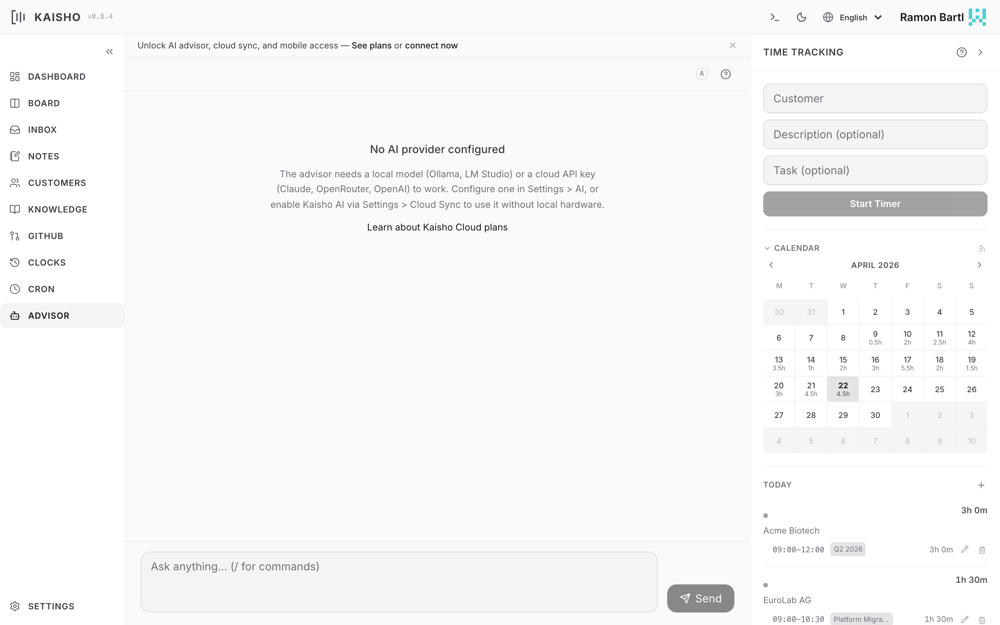

# AI Advisor

The advisor is a context-aware AI assistant built into Kaisho. It
knows your tasks, time entries, customers, notes, and inbox. Ask it
questions in natural language, and it uses tool calling to read and
write your data.

{.screenshot}

## Asking Questions

=== "Web UI"

    Open **Advisor** in the sidebar. Type your question and press
    Enter. Responses stream in real time.

    Quick-start templates are available for common queries:

    - "What should I focus on today?"
    - "Which customers are close to their budget limit?"
    - "Summarize my week"
    - "What are my overdue tasks?"

=== "CLI"

    ```bash
    kai ask "What should I focus on today?"
    kai ask "How many hours did I bill Acme this month?"
    kai ask "Create a task for Beta Inc: fix the login bug"
    ```

=== "Command Bar"

    Press ++cmd+j++ and type:

    ```
    ask What should I focus on today?
    ```

## How It Works

When you ask a question, the advisor:

1. Gathers context: open tasks, this month's clock entries, inbox
   items, customers with budgets, and optionally GitHub issues.
2. Sends your question plus context to the configured AI model.
3. The model can call **tools** to read more data or take actions
   (start a timer, create a task, add an inbox item, etc.).
4. The response streams back as Markdown.

The advisor supports multi-turn conversation. Follow-up questions
include the previous exchange as context.

## Available Tools

The advisor has access to 40 tools covering every domain:

| Category | Tools |
|----------|-------|
| Tasks | list, add, update, move, archive, set tags |
| Time | start/stop clock, book time, update entries, batch invoice |
| Customers | list, get budgets, list contracts |
| Inbox | list, add items |
| Notes | list, add, update, delete |
| Knowledge | search, read files, write files |
| GitHub | list issues, list projects |
| Cron | list jobs, trigger jobs |
| Research | web search, fetch URLs, YouTube transcripts |
| System | list profiles, create backups, time insights |

## Model Selection

The advisor model is configured in **Settings > AI**. You can change
it per conversation in the UI using the model badge.

Supported providers: Ollama (local), Ollama Cloud, LM Studio,
Claude, OpenAI, OpenRouter, and Kaisho Cloud AI.

See [AI Providers](providers.md) for setup instructions.

## Personality

The advisor's personality is shaped by two files in your profile
directory:

- **SOUL.md** -- tone, behavioral rules, response style
- **USER.md** -- context about you (role, workflow, priorities)

Edit these in **Settings > Advisor Files** or directly:

```
~/.kaisho/profiles/work/SOUL.md
~/.kaisho/profiles/work/USER.md
```

## Conversation Actions

- **Copy to inbox** -- click the inbox icon on any assistant
  response to save it as an inbox item
- **Clear history** -- start a fresh conversation
- **Include GitHub** -- toggle whether GitHub issues are included
  in the context

## Conversation History

The UI persists conversation history in the browser. An unread badge
appears in the sidebar when there are new responses (e.g., from
background queries).

## Using Kaisho from Claude Code

:octicons-tag-24: Added in v0.9.0
{ .version-badge }

The same 40 tools available to the built-in advisor are also
accessible from Claude Code, Claude Desktop, and Cursor via the
[MCP Server](../integrations/mcp.md).

Add `mcpServers` to `~/.claude.json` (global) or `.mcp.json`
(project root):

```json
{
  "mcpServers": {
    "kaisho": {
      "command": "kai",
      "args": [
        "mcp-server",
        "--profile", "org-mode",
        "--allow", "read,write"
      ]
    }
  }
}
```

Restart Claude Code, then ask naturally:

- "What tasks do I have open for Acme?"
- "Start a clock for Beta Inc, working on the API"
- "How many hours did I bill this month?"
- "Add an inbox item: check SSL cert renewal"
- "Search my knowledge base for deployment notes"

Claude Code calls Kaisho's tools behind the scenes. You work in
your editor and Kaisho is just there -- no tab switching, no
copy-paste.

Change `--profile` to match your active profile name. Use
`--allow read` for read-only access or `--allow destructive` for
full access including deletes.

See [MCP Server](../integrations/mcp.md) for detailed setup,
all available tools, and security configuration.
