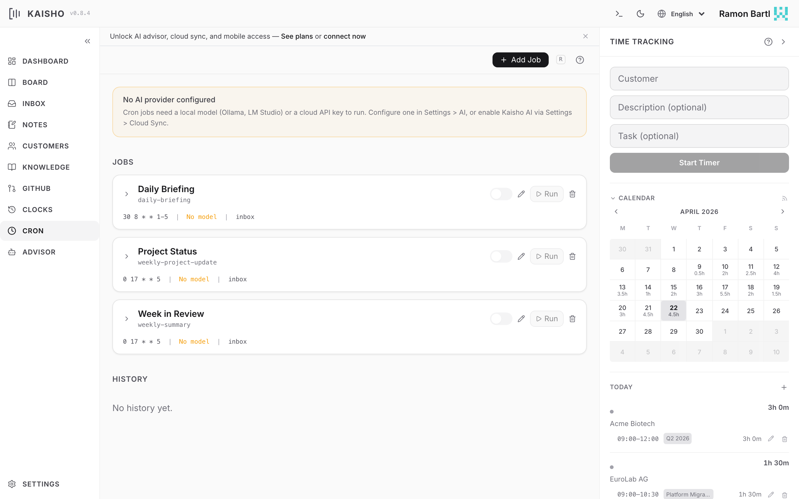

# Cron Jobs

Cron jobs run AI prompts on a schedule. They generate briefings,
summaries, research reports, and more -- delivered to your inbox or
written to files.

{.screenshot}

## How Cron Jobs Work

1. You define a job with a schedule (cron expression), a prompt
   template, and an output destination.
2. APScheduler fires the job at the scheduled time.
3. The executor loads the prompt, gathers context, and sends it to
   the configured AI model.
4. The model can use all 43 tools (same as the advisor).
5. The result goes to your inbox, a file, or stdout.

## Default Jobs

Fresh profiles include two example jobs:

| Job | Schedule | Description |
|-----|----------|-------------|
| `daily-briefing` | 8:30 Mon-Fri | Morning overview of tasks, inbox, budgets |
| `weekly-summary` | 17:00 Friday | Week recap with hours, completed tasks |

Both are disabled by default. Enable them in **Settings > Cron** or:

```bash
kai cron enable daily-briefing
```

## Creating a Job

=== "Web UI"

    Open **Cron** in the sidebar. Click **Add Job**. Fill in:

    - **ID**: unique identifier (e.g., `weekly-report`)
    - **Name**: display name
    - **Schedule**: cron expression
    - **Model**: AI model to use
    - **Prompt**: the prompt template
    - **Output**: where results go (`inbox` or a file path)

=== "CLI"

    ```bash
    kai cron add project-update "Project Status Update" \
        --schedule "0 17 * * 5" \
        --model "ollama:qwen3:14b" \
        --prompt-file prompts/project-update.md \
        --output inbox
    ```

## Cron Expressions

Standard five-field cron syntax:

```
 ┌─── minute (0-59)
 │ ┌─── hour (0-23)
 │ │ ┌─── day of month (1-31)
 │ │ │ ┌─── month (1-12)
 │ │ │ │ ┌─── day of week (0-6, Mon=1)
 │ │ │ │ │
 * * * * *
```

Examples:

| Expression | Meaning |
|------------|---------|
| `30 8 * * 1-5` | 8:30 AM, Monday through Friday |
| `0 17 * * 5` | 5:00 PM every Friday |
| `0 9 1 * *` | 9:00 AM on the 1st of each month |
| `*/30 * * * *` | Every 30 minutes |

## Prompt Templates

Prompts are Markdown files stored in `prompts/` or the profile
directory. They support YAML frontmatter for pre-fetch URLs:

```markdown
---
fetch:
  - https://news.ycombinator.com/rss
---

Summarize the top tech news today. Focus on items relevant
to my current projects.

Context about my projects:
- Use the list_tasks tool to see what I'm working on
- Check my customers with list_customers
```

Template variables:

| Variable | Value |
|----------|-------|
| `{today}` | Current date |
| `{fetch_results}` | Content from fetched URLs |

## Managing Jobs

```bash
kai cron list                    # List all jobs
kai cron show daily-briefing     # Show job details
kai cron trigger daily-briefing  # Run now
kai cron disable daily-briefing  # Pause
kai cron enable daily-briefing   # Resume
kai cron delete daily-briefing   # Remove
```

## Execution History

View past runs with status, output, and error messages:

```bash
kai cron history
kai cron history daily-briefing --limit 5
```

In the UI, the history pane shows sortable columns with execution
results. Click a row to see the full output. Move outputs to inbox,
tasks, notes, or the knowledge base.

## Kaisho AI for cron jobs

To route a cron job through the Kaisho Cloud AI gateway, set
its `model` field to `kaisho:cron`. The gateway picks the
upstream model and meters tokens against your Sync+AI plan
quota. There is no separate "use Kaisho AI" toggle — the
`model` field is the single source of truth.

The cloud cron path runs an agentic loop with a restricted
tool set (read + research only: `fetch_url`,
`transcribe_youtube`, `web_search`, `search_knowledge`,
`read_knowledge_file`). Destructive tools (`delete_*`,
`execute_cli`, profile management) are not exposed to cron.

## Pre-injected Kaisho context

Cron jobs with `inject_context: true` (the default) get a
markdown block prepended to their prompt with the user's open
tasks, recent clock entries, inbox items, customer budgets, and
time insights. This lets briefing/summary/report templates work
on any model — including those that cannot tool-call.

For news/research crons (e.g. HN digest, business scout) the
local data isn't relevant; set `inject_context: false` in the
job definition to skip it. This avoids shipping customer/budget
data to the upstream LLM provider unnecessarily and saves
tokens.

## Templates

Default templates ship with `templates/jobs.yaml`:

| Template | Category | Inject context | Tools |
|----------|----------|----------------|-------|
| daily-briefing | briefing | yes | none |
| weekly-summary | report | yes | none |
| weekly-project-update | report | yes | none |
| hn-ai-daily | news | no | none |
| weekly-scout | research | no | required |

`weekly-scout` requires a tool-capable model (Haiku 4.5 via
`kaisho:cron`, or `qwen3:32b` / `llama3.3:70b` locally). Gemma
family models do not tool-call and will fail this template.

Create new jobs from a template via the Cron view's "From
Template" picker, or by asking the advisor:
"Create a daily HN digest cron called my-hn".
