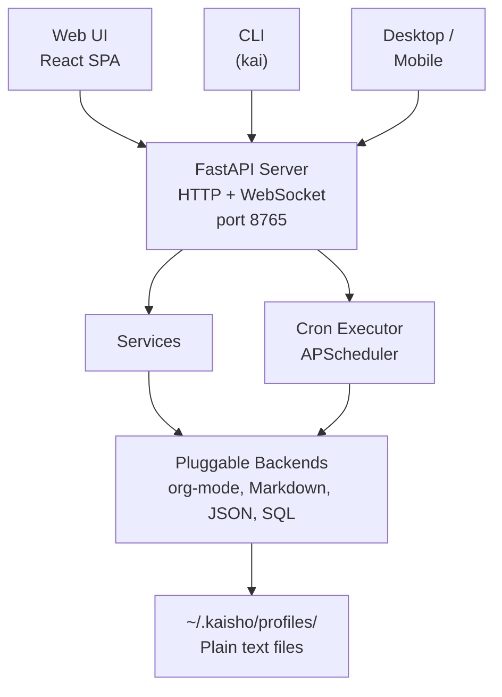

# Architecture

Kaisho is built as a single-user productivity system that runs
locally. Understanding the layers helps when configuring, extending,
or debugging.

## System Overview



## Layers

### API Layer

FastAPI serves both the REST API and the frontend SPA. All endpoints
live under `/api/`. The frontend is a static build served from the
same port.

Key middleware:

- **CORS** -- allows the Vite dev server during development
- **File watcher** -- detects changes to data files and broadcasts
  updates via WebSocket
- **Lifespan** -- initializes the profile, starts the scheduler,
  sets up file watchers on startup

### Services Layer

Business logic lives in `kaisho/services/`. Each service is a
stateless module with pure functions:

| Service | Responsibility |
|---------|----------------|
| `kanban` | Task CRUD, status transitions, tags |
| `clocks` | Timer start/stop, booking, duration math |
| `customers` | Customer and contract management |
| `inbox` | Capture and triage items |
| `notes` | Note creation and organization |
| `knowledge` | File search, PDF extraction, path safety |
| `advisor` | AI chat with tool calling |
| `settings` | YAML config read/write |
| `cloud_sync` | Bidirectional cloud synchronization |
| `github` | GitHub REST API integration |
| `cron` | Job definitions and history |
| `backup` | Zip archive creation and pruning |

Services never import from the API layer. The API routers call
services; the CLI calls services; the cron executor calls services.
This keeps every interface consistent.

### Backend Layer

Storage is abstracted behind a set of backend interfaces. Each
backend implements the same methods for tasks, clocks, customers,
inbox, and notes.

See [Storage Backends](backends.md) for details.

### Data Layer

All data for a profile lives in a single directory:

```
~/.kaisho/profiles/work/
  settings.yaml      # Configuration
  jobs.yaml          # Cron job definitions
  user.yaml          # User profile metadata
  SOUL.md            # AI advisor personality
  USER.md            # AI advisor user context
  SKILLS/            # Reusable advisor prompts
  cron_history.json  # Job execution log
  org/               # Org-mode backend files
    todos.org
    clocks.org
    customers.org
    inbox.org
    notes.org
    archive.org
```

## Key Design Decisions

**Local-first.**
Data stays on your machine. Cloud sync is opt-in and stores a copy,
not the primary.

**Plain text storage.**
Org-mode and Markdown files are human-readable, version-controllable,
and editable in any text editor. Kaisho watches for external changes
and picks them up automatically.

**Single process.**
The backend, scheduler, and file watcher run in one process. No
database server, no message queue, no microservices.

**Profile isolation.**
Each profile is a separate data directory with its own settings,
backend choice, and AI configuration. Switch profiles to keep work
and personal data apart.
