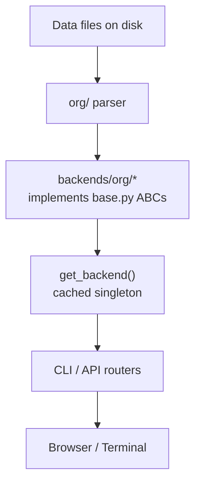

# Developer Guide

## Architecture overview

```
kaisho/
├── backends/          # Pluggable storage drivers
│   ├── base.py        # Abstract base classes (the interface contract)
│   ├── org/           # Org-mode implementation (default)
│   └── markdown/      # Markdown implementation
├── org/               # Low-level org-mode parser and writer
│   ├── models.py      # Heading, Clock, OrgFile dataclasses
│   ├── parser.py      # Text → OrgFile tree
│   ├── clock.py       # Clock entry parsing and formatting
│   └── writer.py      # OrgFile → text (round-trip safe)
├── services/          # Business logic used by org backend
│   ├── kanban.py      # Task CRUD, state transitions, archive
│   ├── clocks.py      # Clock entries, timer, quick-book
│   ├── customers.py   # Budget calculation, time entries, contracts
│   ├── inbox.py       # Capture + auto-categorize
│   ├── notes.py       # Notes CRUD
│   ├── knowledge.py   # File tree, full-text search
│   ├── cron.py        # Cron job CRUD and history
│   ├── github.py      # GitHub API via gh CLI
│   ├── advisor.py     # AI LLM calls
│   ├── dashboard.py   # Aggregation across all domains
│   └── settings.py    # settings.yaml read/write
├── cli/               # Click command groups
└── api/               # FastAPI application
    ├── app.py
    ├── routers/       # One router per domain
    ├── watcher/       # watchfiles background task
    └── ws/            # WebSocket connection manager

frontend/              # Vite + React 18 + TypeScript
├── src/
│   ├── api/           # Fetch wrappers for all endpoints
│   ├── context/       # ViewContext, ShortcutsContext
│   ├── docs/          # In-app help text per panel (panelDocs.ts)
│   ├── hooks/         # TanStack Query hooks per domain
│   ├── utils/         # panelActions.ts (panel open_form trigger)
│   └── components/
│       ├── common/    # CustomerAutocomplete, TaskAutocomplete,
│       │              # TagDropdown, Markdown, HelpButton, Toggle,
│       │              # ContentPopup
│       ├── dashboard/ # DashboardView
│       ├── kanban/    # KanbanBoard, KanbanColumn, TaskCard
│       ├── calendar/  # CalendarView
│       ├── clock/     # ClockWidget, ActiveTimer, ClockView, forms
│       ├── customers/ # CustomersView, CustomerCard
│       ├── inbox/     # InboxView, InboxItemRow, AddInboxForm
│       ├── notes/     # NotesView
│       ├── knowledge/ # KnowledgeView
│       ├── github/    # GithubView
│       ├── cron/      # CronView
│       ├── settings/  # SettingsView
│       ├── advisor/   # AdvisorView
│       └── nav/       # Sidebar
```

## Data flow



The CLI and API never import from `org/` or `services/kanban` directly.
All storage access goes through `get_backend()`.

## Backend interface

Five abstract base classes live in `backends/base.py`:

| Class             | Methods                                                                                                                               |
|-------------------|---------------------------------------------------------------------------------------------------------------------------------------|
| `TaskBackend`     | `list_tasks`, `add_task`, `move_task`, `set_tags`, `archive_task`, `update_task`, `list_all_tags`, `list_archived`, `unarchive_task` |
| `ClockBackend`    | `list_entries`, `get_active`, `get_summary`, `start`, `stop`, `quick_book`, `update_entry`, `delete_entry`                          |
| `InboxBackend`    | `list_items`, `add_item`, `remove_item`, `update_item`, `promote_to_task`                                                            |
| `CustomerBackend` | `list_customers`, `get_customer`, `get_budget_summary`, `add_customer`, `update_customer`, `list_contracts`, `add_contract`, `update_contract`, `close_contract`, `delete_contract` |
| `NotesBackend`    | `list_notes`, `add_note`, `delete_note`, `update_note`, `promote_to_task`                                                            |

Each class also exposes `data_file: Path | None` used by the `edit`
CLI subcommands.

Key task dict fields: `id`, `customer`, `title`, `status`, `tags`,
`properties`, `created`, `body`. The `body` field contains
user-editable text (state log entries are filtered out automatically).

## Archive behavior

`TaskBackend.archive_task` moves a task to `archive.org` under the
`* Archiv` heading as a level-2 child, adding the four standard org
archive properties (`ARCHIVE_TIME`, `ARCHIVE_FILE`,
`ARCHIVE_CATEGORY`, `ARCHIVE_TODO`). This is compatible with
`org-archive-subtree-default` in Emacs.

`list_archived` returns archived tasks with an additional
`archived_at` and `archive_status` field. `unarchive_task` restores
the heading to `todos.org`, stripping the `ARCHIVE_*` properties.

## Adding a new backend

1. Create `kaisho/backends/myformat/__init__.py`.
2. Implement `MyFormatTaskBackend(TaskBackend)`, etc.
3. Add a `make_myformat_backend(cfg) -> tuple[...]` factory that
   returns the four backends and a `list[Path]` of paths to watch.
4. Register it in `backends/__init__.py`:

```python
elif backend_type == "myformat":
    from .myformat import make_myformat_backend
    tasks, clocks, inbox, customers, watch = make_myformat_backend(cfg)
```

5. Set `BACKEND=myformat` in `.env`.

The markdown backend in `backends/markdown/` is a complete
reference implementation.

## Return types

All backend methods return plain `dict` objects (not Pydantic models)
to keep the interface simple and language-independent. The dict shapes
are documented in `backends/base.py` docstrings.

## File watcher

The API starts a background `asyncio` task via `watchfiles.awatch`
that monitors every path in `backend.watch_paths`. When a file
changes, it maps the file stem to a WebSocket resource name using
`_STEM_TO_RESOURCE` in `api/watcher/service.py` and broadcasts a
`file_changed` event. The frontend's `useWebSocket` hook calls
`queryClient.invalidateQueries` on the matching query key.

To add a new watchable resource, add its stem → resource name entry
to `_STEM_TO_RESOURCE` and handle the resource name in the frontend
hook's `RESOURCE_TO_QUERY` map.

## Org-mode parser notes

The parser in `org/parser.py` produces a tree of `Heading` objects.
Each heading tracks a `dirty: bool` flag. The writer uses the original
`raw_lines` for clean headings and reconstructs text for dirty ones,
preserving all formatting that Kaisho did not touch.

`Heading.body` is a `list[str]` that holds all text lines below the
properties/logbook block. State transition log lines (inserted by
`move_task`) start with `- State "` and are kept at the front of
`body`. `_user_body()` in `services/kanban.py` strips those lines
when returning body text to the API; `_update_body()` re-inserts them
when saving.

Known keywords (task states) must be passed to `parse_org_file` so
the parser can identify `keyword title` headings correctly. The org
backend resolves keywords from `settings.yaml` at startup.

## Panel action system

`utils/panelActions.ts` provides a lightweight mechanism to trigger
an "open form" action in a panel. The command palette and double-tap
keyboard shortcuts use `schedulePanelAction(panel, "open_form")`.
Each panel registers its handler with `registerPanelAction` in a
`useEffect`. Double-tapping a view shortcut key (within 500 ms)
triggers the action for that panel.

## Frontend development

```bash
cd frontend
pnpm dev        # dev server on :5173, proxies /api and /ws to :8765
pnpm build      # production build to frontend/dist/
pnpm preview    # serve the production build locally
```

The proxy is configured in `vite.config.ts`. Start `kai serve` first
so the backend is available.

### TanStack Query conventions

- `staleTime: 30_000` by default; active timer uses `refetchInterval: 5_000`.
- After any mutation, `invalidateQueries` is called for the affected
  query key so data refetches automatically.
- WebSocket events trigger the same invalidation without polling.

### Adding a new domain to the frontend

1. Add fetch functions to `src/api/client.ts`.
2. Add hooks to `src/hooks/` following the existing pattern.
3. Build components under `src/components/<domain>/`.
4. Add the resource name to `RESOURCE_TO_QUERY` in `useWebSocket.ts`.
5. Add in-app help text to `src/docs/panelDocs.ts`.

## Running the full stack locally

```bash
# Backend (terminal 1)
source .venv/bin/activate
kai serve --reload

# Frontend (terminal 2)
cd frontend
pnpm dev
```

API docs: `http://localhost:8765/docs`
Frontend: `http://localhost:5173`
