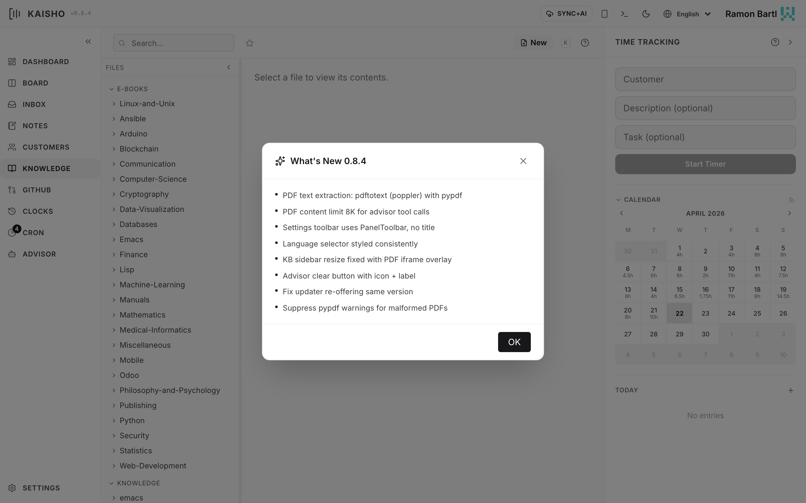

# Knowledge Base

The knowledge base (KB) is a file browser for your reference
material: documentation, runbooks, meeting notes, research. It
supports Markdown, org-mode, plain text, reStructuredText, and PDF
files.

{.screenshot}

## KB Sources

The KB reads from one or more directories configured in
**Settings > Knowledge Base Sources**. Each source has a label
(shown in the sidebar) and a path on disk.

Default source: `~/.kaisho/profiles/<profile>/knowledge/`

Add more sources to include project docs, shared drives, or any
folder with text files:

```yaml
# settings.yaml
kb_sources:
  - label: Personal
    path: ~/.kaisho/profiles/work/knowledge
  - label: Company Docs
    path: ~/Documents/company-wiki
```

## Browsing Files

The KB has a sidebar with a folder tree and a content panel. Click
a file to view it:

- **Markdown** renders with full formatting
- **PDF** opens in an inline viewer
- **Other text files** display as plain text

Star files to mark favorites. Toggle **Show starred only** to filter
the tree.

## Creating Files

Click **New File** in the sidebar. Choose a source, enter a path
(folders are created automatically), and write your content.

```bash
kai kb search "deployment"
kai kb show "runbooks/deploy-checklist.md"
```

## Searching

Full-text search across all KB sources. Results show the file path,
matching line number, and a snippet:

=== "Web UI"

    Type in the search bar above the file tree.

=== "CLI"

    ```bash
    kai kb search "connection pooling" --max 10
    ```

PDF files are included in search results. Kaisho extracts text using
`pdftotext` (poppler) with a fallback to `pypdf`.

## File Operations

- **Rename/move** files within a source
- **Move between sources** (e.g., from Personal to Company Docs)
- **Delete** files (with confirmation)
- **Edit** Markdown files inline with a live preview editor

## Supported File Types

| Extension | Indexed | Viewable |
|-----------|---------|----------|
| `.md` | Yes | Rendered Markdown |
| `.org` | Yes | Plain text |
| `.rst` | Yes | Plain text |
| `.txt` | Yes | Plain text |
| `.pdf` | Yes (text extracted) | Inline PDF viewer |
