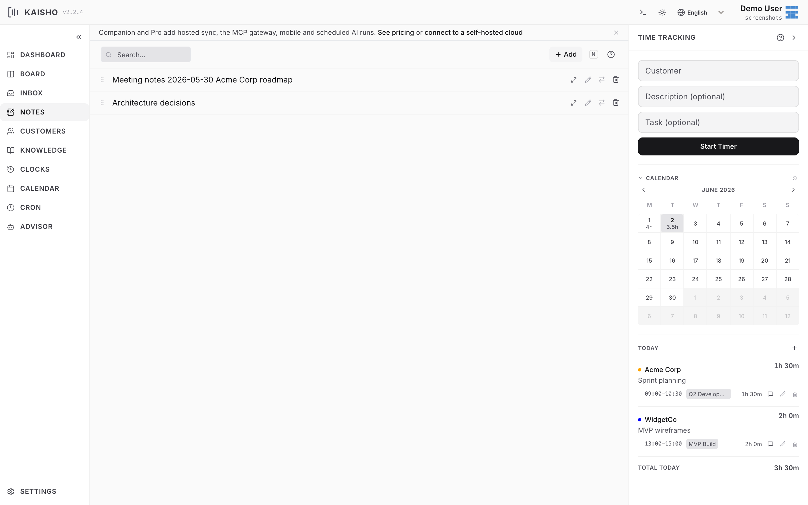

# Notes

Notes are longer-form entries for meeting minutes, technical
decisions, research findings, or anything worth keeping. They can
link to customers and tasks.

{.screenshot}

## Creating Notes

=== "Web UI"

    Open **Notes** in the sidebar. Click **Add Note**, enter a title,
    and write your content in Markdown.

=== "CLI"

    ```bash
    kai notes add "Sprint retro findings" \
        --customer "Acme Corp" \
        --body "## What went well\n- Deploy pipeline stable"
    kai notes add "Auth architecture decision" \
        --tag architecture --tag security
    ```

## Note Fields

| Field | Description |
|-------|-------------|
| Title | Short descriptive name |
| Body | Markdown content |
| Customer | Associated customer (optional) |
| Task ID | Linked task (optional) |
| Tags | Freeform labels |

## Browsing Notes

Notes appear as expandable rows. Click a note to see its full
content rendered as Markdown.

Markdown task-list checkboxes (`- [ ]` / `- [x]`) are
interactive in the rendered view: click one to toggle it and
the note body is saved. This works the same way for task
descriptions, inbox items, and knowledge-base files.

Filter by text search or customer. Notes are drag-reorderable.

## Moving Notes

Notes can move to other destinations:

- **To task** -- creates a task from the note content
- **To knowledge base** -- saves as a KB file
- **To archive** -- soft-deletes the note

Use the action menu on each note row, or the CLI:

```bash
kai notes delete abc123
```

## Linking to Tasks

When a note references a task (via the task ID field), clicking the
link badge navigates to that task on the board. This is useful for
attaching meeting notes or design decisions to specific work items.
