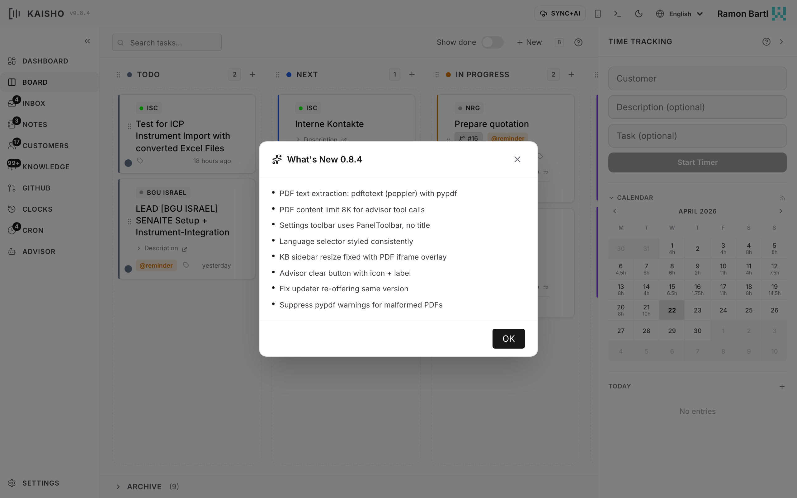

# Task Board

The task board is a kanban view for managing work. Columns represent
status states. Drag tasks between columns to change their status.

{.screenshot}

## Board Layout

Each column corresponds to a task state (TODO, IN-PROGRESS, DONE,
etc.). You define which states exist and their order in
[Settings](../configuration/settings.md).

Tasks appear as cards showing:

- Title
- Customer (color-coded)
- Tags as pills
- GitHub issue link (if set)

## Creating Tasks

=== "Web UI"

    Click **Add Task** in the board toolbar. Fill in customer, title,
    and optionally tags, description, and GitHub URL.

=== "CLI"

    ```bash
    kai task add "Acme Corp" "Implement user auth"
    kai task add "Acme Corp" "Fix login bug" --tag urgent --tag backend
    kai task add "Beta Inc" "Design homepage" \
        --body "Mobile-first, use new brand colors" \
        --github-url "https://github.com/acme/repo/issues/42"
    ```

## Moving Tasks

Drag a card to another column in the UI. From the CLI:

```bash
kai task move abc123 IN-PROGRESS
kai task done abc123
kai task wait abc123
kai task cancel abc123
```

## Filtering

The board toolbar has a search bar with structured filtering:

- Free text matches against title and description
- `customer:Acme` filters by customer name
- `tag:urgent` filters by tag
- `status:TODO` filters by column

Multiple filters combine with AND.

## Tags

Tags are colored labels you attach to tasks. Define tags and their
colors in **Settings > Tags & Types**.

```bash
# Set tags (replaces existing)
kai task tag abc123 urgent backend

# Add a tag (prefix with +)
kai task tag abc123 +frontend

# Remove a tag (prefix with -)
kai task tag abc123 -urgent
```

## Task Details

Click a task card to expand it. The detail view shows:

- Full description (Markdown rendered)
- Customer and status
- Tags (editable)
- GitHub issue link (clickable)
- Creation date

All fields are editable inline.

## Archive

Done and cancelled tasks can be archived. Archived tasks move out
of the board into a separate archive view.

```bash
kai task archive abc123
```

In the UI, archived tasks are accessible from the **Archive** tab
in the board view. You can restore them with **Unarchive**.

## Reordering

Drag tasks within a column to set priority order. The order persists
across sessions.
