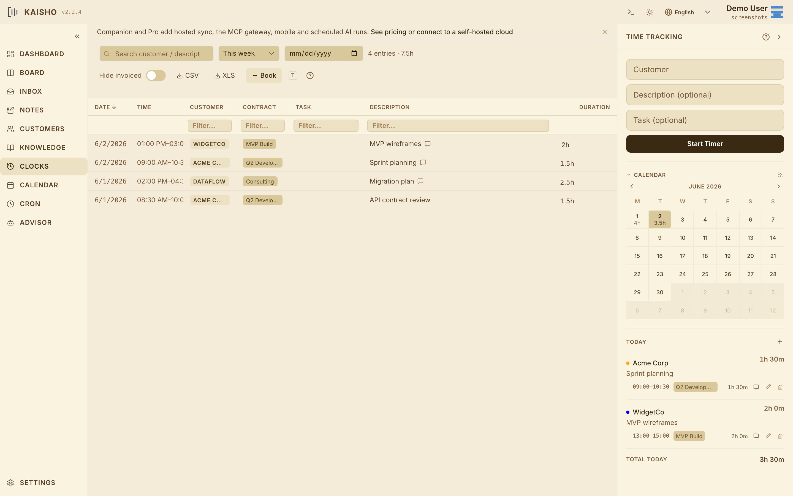

# Time Tracking

Time tracking in Kaisho works three ways: start/stop timers,
retroactive booking, and quick booking. All methods produce the same
clock entries.

{.screenshot}

## Starting a Timer

=== "Web UI"

    The clock widget is always visible on the right side of the
    screen. Optionally select a customer and type a description,
    then press **Start**. Both fields are optional.

    The elapsed time counts up in real time. The header bar and the
    menu bar tray (desktop app) also show the active timer.

=== "CLI"

    ```bash
    kai clock start "Acme Corp" "Working on feature X"
    ```

    Check what's running:

    ```bash
    kai clock status
    ```

=== "Command Bar"

    Press ++cmd+j++ in the UI and type:

    ```
    clock start Acme Corp Working on feature X
    ```

## Stopping a Timer

=== "Web UI"

    Press **Stop** in the clock widget or the active timer banner.

=== "CLI"

    ```bash
    kai clock stop
    ```

    Set description or notes before stopping:

    ```bash
    kai clock stop --desc "Finished the auth module"
    kai clock stop --notes "Needs code review"
    kai clock stop --customer "Beta Inc"  # reassign
    ```

## Rounding and Merging

!!! version-added "Since 1.8.0"

Two booking helpers that cover common workflow cleanup:

- **Round.** `kai clock round 15min` snaps every entry in the
  current day (or `--week`/`--month` range) to the nearest
  rounding interval. The UI exposes the same operation under the
  Clocks toolbar.
- **Merge.** Adjacent entries on the same customer/description
  collapse into one when invoked via `kai clock merge` or the
  table's selection menu. Useful when a long task got split by
  a pause that was forgotten about.

## Booking Retroactively

Forgot to start the timer? Book time after the fact:

```bash
kai clock book 2h "Acme Corp" "Morning standup + planning"
kai clock book 30min "Beta Inc" "Quick bug fix"
```

In the UI, use the **Quick Book** form in the clock widget. Enter
duration, customer, and description.

## Editing Entries

Every clock entry is editable. Click the pencil on a row to open
the edit dialog. The same dialog is used everywhere a time entry
appears -- the Clocks table, the timer sidebar, the entries under a
task card, the dashboard, and the customer view -- so editing works
the same in every place. In the dialog you can:

- Change customer, description, hours, date, contract, project, or
  notes
- Toggle the invoiced flag
- Link the entry to a task

The notes field has **Preview** and **Write** tabs, so links render
as clickable in Preview and switch to a plain text box to edit.

The table supports column filtering (including regex), sorting, and
resizing.

### Bulk editing

Select rows with the leading checkboxes (or the header checkbox to
select all) to reveal the bulk-action bar. It can mark or unmark the
selection as invoiced, set a customer, and set a contract. Setting a
contract requires the selected rows to share a single customer, since
contracts are customer-scoped.

## Viewing Entries

Filter entries by period:

| Filter | CLI | UI |
|--------|-----|----|
| Today | `kai clock list` | Period toggle: Today |
| This week | `kai clock list --week` | Period toggle: Week |
| This month | `kai clock list --month` | Period toggle: Month |
| Specific date | `kai clock list --from 2026-04-01 --to 2026-04-01` | Date picker |
| Custom range | `kai clock list --from 2026-04-01 --to 2026-04-15` | Range checkbox + From/To pickers |
| By customer | `kai clock list --customer "Acme Corp"` | Column filter |

## Summary

See total hours per customer:

```bash
kai clock summary          # this month
kai clock summary --week   # this week
```

The dashboard budget bars show the same data visually.

## Invoicing

Mark entries as invoiced when you bill a customer:

=== "Web UI"

    In the **Clocks** view, filter by customer, select the entries,
    and click **Mark Invoiced**. Or use the invoice preview in the
    customer's contract view.

=== "CLI"

    ```bash
    kai clock batch-invoice "Acme Corp"
    kai clock batch-invoice "Acme Corp" --contract "Q2 2026"
    ```

Toggle the **Hide Invoiced** switch in the clocks toolbar to focus
on unbilled time.

## Export

Export filtered entries as CSV or Excel from the **Clocks** view
toolbar. The export includes all visible columns.

## Menu Bar Tray

!!! version-added "Since 1.8.0"

The desktop app shows a timer icon in the menu bar (macOS) or system
tray (Windows/Linux). The tray pill picks up the active theme so
it matches whatever preset is set on the desktop side.

- **Left-click** opens a popover with the active timer, quick-start
  buttons, and recent entries
- **Right-click** shows a context menu with start/stop actions
- The icon changes color based on timer state: idle, active, or
  running long

Global shortcuts:

- ++cmd+shift+t++ -- Toggle tray popover
- ++cmd+shift+s++ -- Start/stop timer

## iCalendar Feed

Clock entries are available as an iCal feed at:

```
http://localhost:8765/api/clocks/calendar.ics
```

Add this URL to your calendar app to see time entries alongside your
schedule. The feed updates in real time.
