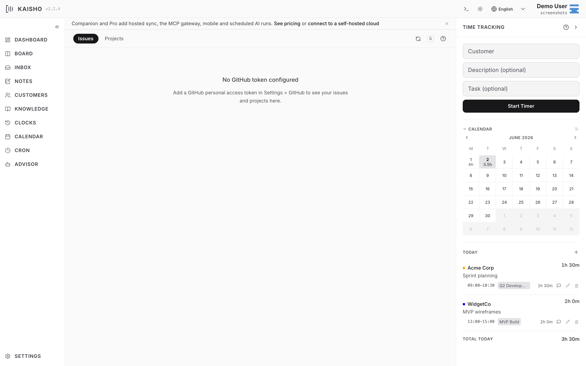

# GitHub Integration

Kaisho connects to GitHub to show issues and pull requests alongside
your tasks and time tracking.

!!! note "One token, in Integrations"

    GitHub is the one integration available on every plan. You
    connect it **once** under **Settings → Integrations**, and that
    single token powers everything:

    - the GitHub sidebar view (issues & PRs grouped by customer) and
      the `kai gh` commands, and
    - the AI advisor's GitHub tools.

    The token is stored **locally**. On **Pro**, the same token is
    additionally stored encrypted in Kaisho Cloud so the hosted MCP
    gateway and the server-side advisor can reach GitHub when the
    desktop is closed (see [MCP Server](mcp.md)). On the free tier it
    stays strictly local.

    View options (hide the sidebar entry, GitHub Enterprise API URL)
    live under the connected GitHub row in **Settings → Integrations**.

{.screenshot}

## Setup

1. Create a [personal access token](https://github.com/settings/tokens)
   with `repo` scope (classic token) or fine-grained token with
   Issues and Pull Requests read access.
2. Go to **Settings → Integrations** and paste the token into the
   GitHub row.

Or edit `settings.yaml`:

```yaml
github:
  token: ghp_xxxxxxxxxxxx
```

## Linking Customers to Repos

Set the `repo` field on a customer to `owner/repo`:

```bash
kai customer add "Acme Corp" --repo "acmeinc/main-app"
```

Or edit the customer in the UI and fill in the repository field.

## Viewing Issues

=== "Web UI"

    Open **GitHub** in the sidebar. Issues are grouped by customer
    and repository. Labels appear as colored pills.

    Filter by customer using the dropdown.

=== "CLI"

    ```bash
    kai gh issues "Acme Corp"
    kai gh issues "Acme Corp" --all     # include closed
    kai gh show "Acme Corp" 42          # show issue #42
    kai gh prs "Acme Corp"              # pull requests
    kai gh open "Acme Corp" 42          # open in browser
    ```

## GitHub Projects v2

List items from GitHub Projects across all customers:

```bash
kai gh projects
kai gh projects --customer "Acme Corp" --status "In Progress"
```

## All Issues Across Repos

See open issues from all linked repositories at once:

```bash
kai gh all-issues
```

## Task-Issue Linking

When creating a task, add a GitHub URL to link it:

```bash
kai task add "Acme Corp" "Fix auth bug" \
    --github-url "https://github.com/acmeinc/main-app/issues/42"
```

The task card shows a clickable GitHub link. The advisor can also
create tasks from GitHub issues using the `add_task` tool.

## AI Context

When the **Include GitHub** toggle is on in the advisor, open issues
for your customers are included in the AI context. This lets the
advisor answer questions like "What are the open issues for Acme?"
without a separate API call.
