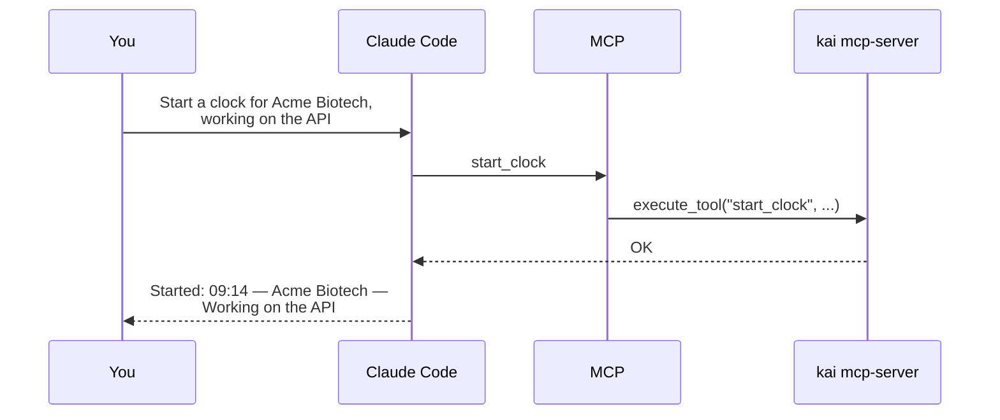
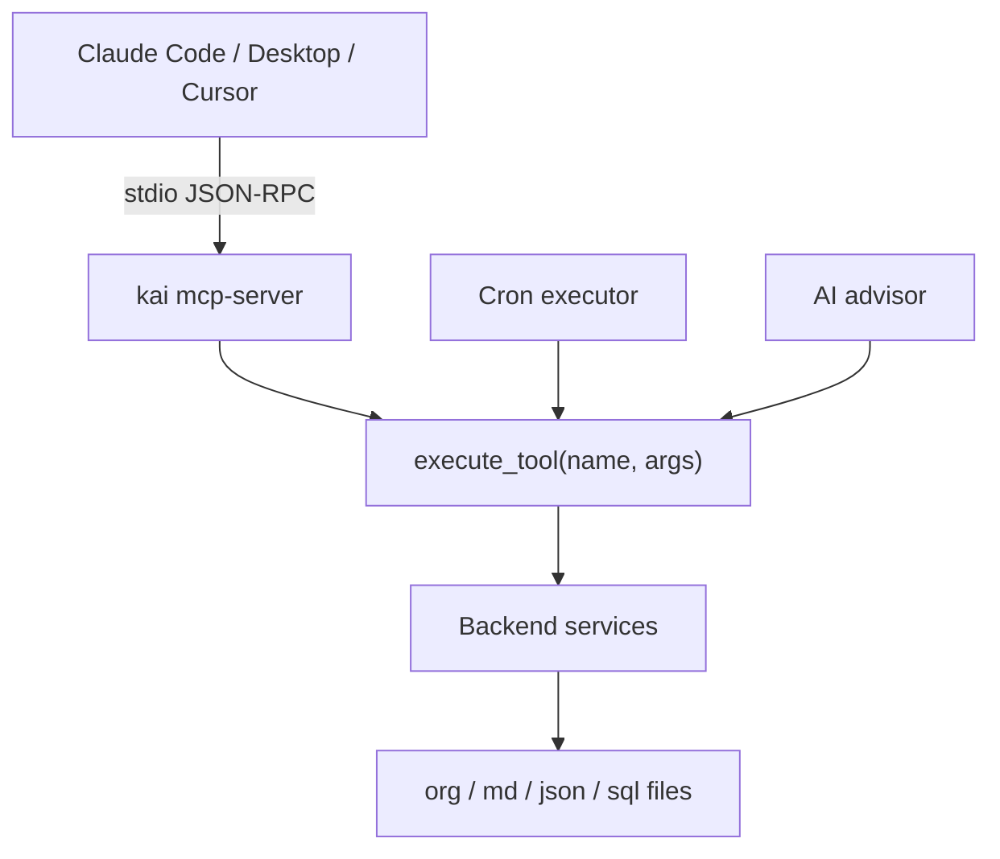

# MCP Server

:octicons-tag-24: Added in v0.9.0
{ .version-badge }

Kaisho exposes its tools via the
[Model Context Protocol](https://modelcontextprotocol.io/) (MCP).
This lets any MCP-compatible client -- Claude Code, Claude Desktop,
Cursor, Zed -- interact with your Kaisho data directly, without
opening the UI.

## What This Enables

You work in your editor or AI assistant and Kaisho is just there.
No tab switching, no copy-paste. Ask Claude to start a timer, check
a budget, or create a task, and it calls Kaisho's tools behind the
scenes.



## Quick Start

Start the MCP server:

```bash
kai mcp-server --profile work --allow read,write
```

This launches a stdio-based MCP server that exposes all read and
write tools for the `work` profile.

## App-Only Setup (No Python Install)

If you installed the Kaisho desktop app (Mac/Linux DMG, AppImage,
deb, or rpm) and don't have a Python development environment, you
don't need to `pip install` anything. The app bundles a
self-contained `kai-server` binary that supports `mcp-server` as a
subcommand identical to the dev CLI.

Point your MCP client at the bundled binary directly.

=== "macOS"

    Binary path:

    ```
    /Applications/Kaisho.app/Contents/MacOS/kai-server
    ```

    Example `~/.claude.json` (Claude Code) or
    `claude_desktop_config.json` (Claude Desktop):

    ```json
    {
      "mcpServers": {
        "kaisho": {
          "command": "/Applications/Kaisho.app/Contents/MacOS/kai-server",
          "args": ["mcp-server", "--allow", "read,write"]
        }
      }
    }
    ```

=== "Linux (deb / rpm)"

    Typical install path:

    ```
    /usr/bin/kai-server
    ```

    (verify with `which kai-server`). Config:

    ```json
    {
      "mcpServers": {
        "kaisho": {
          "command": "/usr/bin/kai-server",
          "args": ["mcp-server", "--allow", "read,write"]
        }
      }
    }
    ```

=== "Linux (AppImage)"

    The AppImage isn't directly callable from outside its sandbox.
    Extract the bundled binary once:

    ```bash
    ./Kaisho-*.AppImage --appimage-extract
    cp ./squashfs-root/usr/bin/kai-server ~/.local/bin/kai-server
    ```

    Then reference `~/.local/bin/kai-server` in your MCP config.

### Profile Selection

By default (no `--profile` argument), the MCP server **follows the
profile currently active in the Kaisho app** -- if you switch
profiles in the UI, tools land in the new profile automatically.
This is usually what you want.

Pass `--profile NAME` only when you intentionally need a pinned
scope (running multiple MCP servers for different profiles, or for
automation that should not drift):

```json
"args": ["mcp-server", "--profile", "personal", "--allow", "read,write"]
```

### Verification

After restarting your MCP client, you should see Kaisho's tools in
its tool list (`list_tasks`, `start_clock`, `add_note`, etc.). To
confirm which profile the server is talking to, tail the per-call
audit log -- the path tracks the active profile:

```bash
ls -lt ~/.kaisho/profiles/*/mcp-audit.log
```

The file that updates after a tool call is the profile MCP just
wrote to. The data dir is `~/.kaisho/` regardless of how the app
was installed, so the bundled binary and the GUI app share state.

## Client Configuration

### Claude Code

Add the `mcpServers` key to `~/.claude.json` (global, all
sessions) or to `.mcp.json` in a project root (project-specific):

```json
{
  "mcpServers": {
    "kaisho": {
      "command": "kai",
      "args": [
        "mcp-server",
        "--profile", "work",
        "--allow", "read,write"
      ]
    }
  }
}
```

!!! note
    If `kai` isn't on PATH when Claude Code spawns the subprocess
    (common with pyenv), use the full path or a wrapper script:

    ```json
    "command": "/path/to/scripts/mcp-server.sh"
    ```

### Claude Desktop

Add to your Claude Desktop config
(`~/Library/Application Support/Claude/claude_desktop_config.json`
on macOS):

```json
{
  "mcpServers": {
    "kaisho": {
      "command": "kai",
      "args": [
        "mcp-server",
        "--profile", "work",
        "--allow", "read,write"
      ]
    }
  }
}
```

### Cursor

Add to `.cursor/mcp.json` in your project root:

```json
{
  "mcpServers": {
    "kaisho": {
      "command": "kai",
      "args": ["mcp-server", "-p", "work", "-a", "read,write"]
    }
  }
}
```

### Multiple Profiles

Register separate server entries per profile:

```json
{
  "mcpServers": {
    "kaisho-work": {
      "command": "kai",
      "args": ["mcp-server", "-p", "work", "-a", "read,write"]
    },
    "kaisho-personal": {
      "command": "kai",
      "args": ["mcp-server", "-p", "personal", "-a", "read"]
    }
  }
}
```

## Access Tiers

Not all tools are exposed by default. Three tiers control what the
MCP server makes available:

| Tier | Default | Description |
|------|---------|-------------|
| `read` | On | Query tasks, entries, customers, KB, GitHub |
| `write` | Off | Create/update tasks, start timers, book time |
| `destructive` | Off | Delete notes, archive tasks, run arbitrary CLI |

The `--allow` flag controls which tiers are active:

```bash
kai mcp-server --allow read             # read-only (default)
kai mcp-server --allow read,write       # read + write
kai mcp-server --allow destructive      # all tiers (destructive implies read,write)
```

MCP clients that support tool annotations see `readOnlyHint` and
`destructiveHint` flags, so they can display confirmation prompts
for write and destructive operations.

### Read Tools

| Tool | Description |
|------|-------------|
| `list_tasks` | Query kanban board with filters |
| `list_inbox` | List inbox items |
| `list_clock_entries` | Time entries by period |
| `list_customers` | All customers with budgets |
| `list_contracts` | Contracts for a customer |
| `list_notes` | All notes |
| `list_kb_files` | Knowledge base file tree |
| `search_knowledge` | Full-text KB search |
| `read_knowledge_file` | Read a KB file |
| `list_github_issues` | Open GitHub issues |
| `list_github_projects` | GitHub Projects v2 |
| `list_cron_jobs` | Scheduled jobs |
| `list_profiles` | Available profiles |
| `list_backups` | Backup archives |
| `get_time_insights` | Time analytics |
| `transcribe_youtube` | YouTube captions |
| `web_search` | Web search |
| `fetch_url` | Fetch URL content |

### Write Tools

| Tool | Description |
|------|-------------|
| `add_task` | Create task |
| `update_task` | Modify task fields |
| `move_task` | Change task status |
| `set_task_tags` | Replace task tags |
| `add_inbox_item` | Capture inbox item |
| `add_note` | Create note |
| `update_note` | Modify note |
| `start_clock` | Start timer |
| `stop_clock` | Stop timer |
| `book_time` | Book retroactive time |
| `update_clock_entry` | Edit clock entry |
| `batch_invoice` | Mark entries invoiced |
| `write_kb_file` | Create KB file (max 1 MB; refuses overwrite without `overwrite=true`) |
| `archive_task` | Archive a task (reversible) |
| `approve_url_domain` | Add URL to allowlist |
| `create_backup` | Create data backup |

### Destructive Tools

| Tool | Description |
|------|-------------|
| `delete_task` | Delete a task |
| `delete_note` | Delete a note |
| `delete_customer` | Delete a customer and all linked data |
| `delete_clock_entry` | Delete a clock entry |
| `delete_profile` | Delete a profile |
| `rename_profile` | Rename a profile |
| `create_skill` | Skill content is auto-injected into every advisor prompt |
| `trigger_cron_job` | Spawns a fresh agentic loop with its own write budget |
| `execute_cli` | Run arbitrary CLI commands |

## Use Cases

### Session Start with Context

> "Start a clock for Acme Biotech, show me the open tasks for
> that customer, and check their budget."

Tools used: `start_clock` + `list_tasks` + `list_contracts`

### Capture While Coding

> "Add an inbox item: check if SSL certs expire this month."

Tools used: `add_inbox_item`

### Commit Follow-Up

> "Create a task for Beta Inc: write tests for the auth edge
> case. Tag it with backend and testing."

Tools used: `add_task` + `set_task_tags`

### End-of-Day Booking

> "Stop the clock, but only bill 2 hours. The rest was
> research. Then move task abc123 to DONE."

Tools used: `stop_clock` + `update_clock_entry` + `move_task`

### Morning Briefing

> "What's on my plate today? Focus on tasks with deadlines
> this week and tell me which customer is closest to their
> budget limit."

Tools used: `list_tasks` + `list_contracts` + `get_time_insights`

### Research to Knowledge Base

> "Search the web for current vLLM benchmarks, summarize the
> findings, and save them under kb/research/vllm-benchmarks.md."

Tools used: `web_search` + `fetch_url` + `write_kb_file`

### Cross-Context Workflow

This is the real power of MCP. A single prompt that combines
code context (your editor), business context (Kaisho), and
knowledge context (your KB):

> "I need to build feature X for Acme Biotech. Check how many
> hours are left on their contract, search my KB for notes about
> their API, and suggest a breakdown into 3 tasks."

Tools used: `list_contracts` + `search_knowledge` + `add_task`
(x3)

## Audit Log

Every tool call is logged to
`~/.kaisho/profiles/<profile>/mcp-audit.log` in JSON Lines format:

```json
{"ts": "2026-04-22T10:15:00+00:00", "tool": "list_tasks", "args": {"customer": "Acme"}, "ok": true}
{"ts": "2026-04-22T10:15:01+00:00", "tool": "start_clock", "args": {"customer": "Acme", "description": "API work"}, "ok": true}
```

This provides traceability for tool calls made outside the Kaisho
UI.

## Safety guards

Every call into `execute_tool()` (MCP, cron, advisor) goes through
a shared per-session guard layer in `kaisho/cron/guards.py`:

- **Per-session write cap**: 5 non-read tool calls per session.
- **KB-specific write cap**: 3 `write_kb_file` calls per session,
  on top of the general cap.
- **No silent overwrite**: `write_kb_file` refuses to replace an
  existing file unless the caller passes `overwrite=true`.
- **Size cap**: `write_kb_file` rejects payloads larger than 1 MB.
- **Auto-snapshot**: the first non-read tool call of a session
  triggers a full profile backup (same path as `create_backup`),
  throttled to once every 10 minutes process-wide. If the
  snapshot fails the throttle is rolled back so the next attempt
  retries instead of being silently locked out.

The `MCP server` resets the guard counters at the start of every
request so a long-lived MCP client doesn't monotonically deplete
its budget over the lifetime of the connection.

The advisor uses an additional allowlist that excludes every
`tier=destructive` tool, so a prompt-injection cannot talk it
into a `delete_*` or `rename_profile` call regardless of what
the user prompt asks for. MCP clients that pass `allow="destructive"`
explicitly bypass that allowlist (the assumption being that the
human running the MCP client made an informed choice).

## Architecture

The MCP server reuses the same `execute_tool()` dispatcher as the
cron executor and AI advisor. All three interfaces call the same
backend functions, so tool behavior is identical everywhere.



The server runs as a standalone process (started by the MCP client
as a subprocess). It accesses the profile's data files directly,
not via HTTP to the running FastAPI server.

## Security

**Transport**: stdio only (no network ports). The MCP client starts
the server as a subprocess. Trust boundary = OS user.

**Profile scoping**: by default (no `--profile`), the MCP server
follows the active profile of the running `kai serve` instance. It
re-reads `<data_dir>/.active_profile` at the start of every tool
dispatch and rebuilds its backend if the user has switched profiles
in the UI, so tool writes always land in the profile you currently
see. The audit log path is recomputed per dispatch too, so
`<profile>/mcp-audit.log` follows the data.

Pass `--profile NAME` to pin the server to one profile regardless of
UI switches (useful when you run several MCP servers in parallel for
different profiles, or want stable scoping for automation).

**Tier filtering**: tools are filtered at startup based on
`--allow`. A read-only server cannot call write tools even if the
client requests them.

**No secrets exposure**: API keys and credentials in `settings.yaml`
are never returned by any tool. The settings service is not exposed
as an MCP tool.
