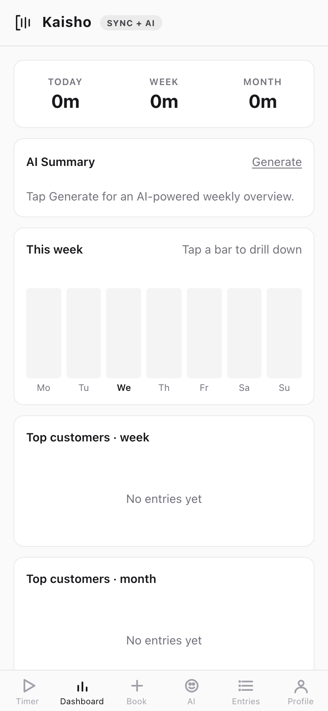
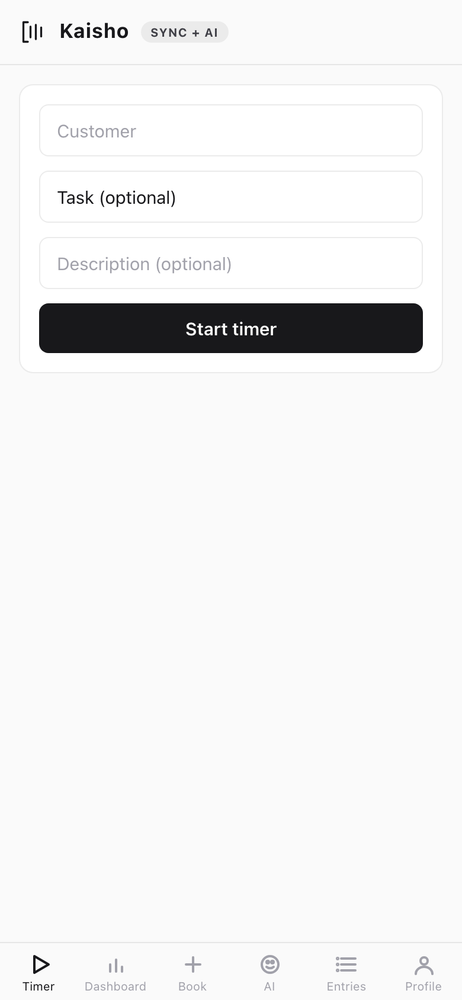
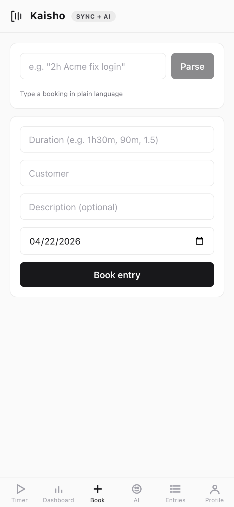
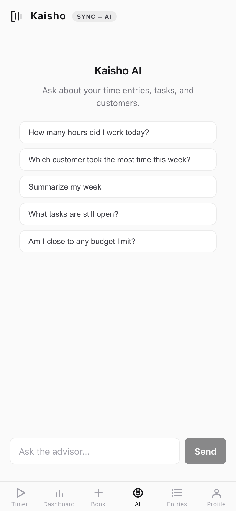
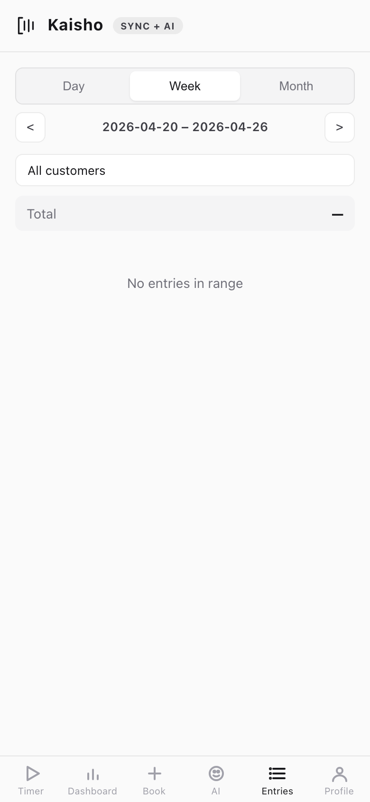
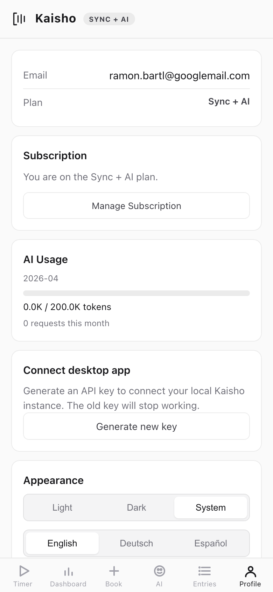

# Mobile PWA

The mobile app is a Progressive Web App (PWA) that connects to
Kaisho Cloud for time tracking on the go.

## Access

Open your Kaisho Cloud URL in a mobile browser. Add to home screen
for a native-app experience.

## Panels

The PWA has six panels accessible from the bottom tab bar.

### Dashboard

Hours tracked today, this week, and this month. Weekly bar chart,
top customers, and an AI-powered summary you can generate on tap.

{.screenshot style="max-width:300px"}

### Timer

Start and stop timers with customer, task, and description fields.

{.screenshot style="max-width:300px"}

### Quick Book

Book time retroactively. Select customer, date, duration, and
description.

{.screenshot style="max-width:300px"}

### AI Advisor

Ask questions about your time, tasks, and customers. Includes
quick-start templates. Requires a Sync + AI plan.

{.screenshot style="max-width:300px"}

### Entries

Browse and edit time entries by date. Tap an entry to edit
customer, description, hours, or notes.

{.screenshot style="max-width:300px"}

### Profile

Account settings, appearance (theme, language), AI token usage
meter, and sign-out.

{.screenshot style="max-width:300px"}

## Sync

Changes on mobile sync to the desktop via Kaisho Cloud. Entries
created offline queue locally and push when the connection resumes.

Entries without a customer assignment appear in the desktop's
**Cloud Triage** panel for batch assignment.

## Language Support

The PWA supports English, German, and Spanish. Switch languages in
**Profile > Appearance**.

## Requirements

- Kaisho Cloud subscription (Sync or Sync + AI plan)
- Modern mobile browser (Safari, Chrome, Firefox)
- Desktop app connected to Cloud Sync for bidirectional data flow
